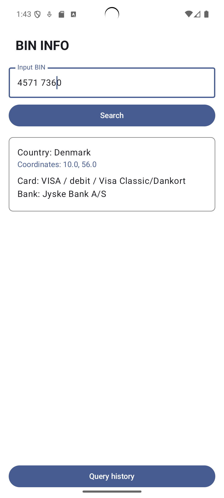
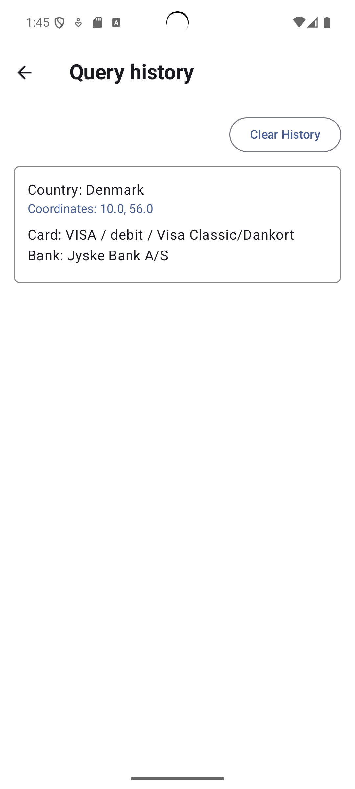
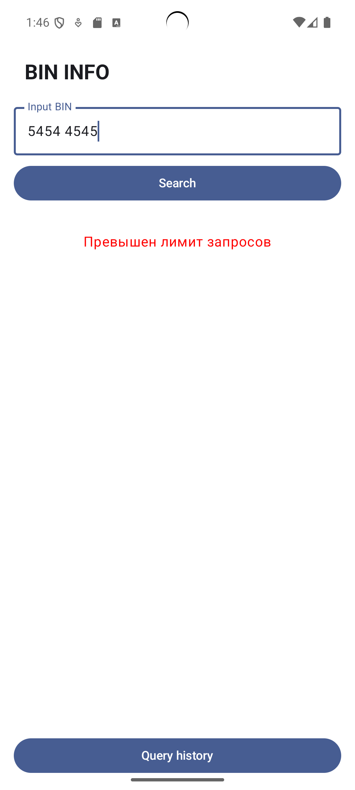

# BinInfoApp

**BinInfoApp** — это Android-приложение, которое позволяет получить информацию о банковской карте по её BIN (Bank Identification Number). Приложение построено на основе **MVVM + Clean Architecture**, использует **Jetpack Compose**, **Kotlin**, **Hilt** и **Coroutines**.

---

## Скриншоты

Экран запроса BIN | История запросов | Ошибка
:--:|:--:|:--:
 |  | 

---

## ✅ Реализованные требования

### 🔹 Обязательный функционал

- [x] Пользователь вводит BIN карты
- [x] Загрузка информации с API [`https://binlist.net`](https://binlist.net)
- [x] Отображение информации:
  - Страна, город, координаты
  - Тип карты (дебетовая/кредитная, Visa/MasterCard)
  - Данные банка: название, телефон, сайт
- [x] Экран истории запросов
  - Список ранее запрашиваемых BIN
  - Кэширование истории (сохраняется при перезапуске приложения)

### 🔸 Дополнительные возможности

- [x] Обработка ошибок (некорректный BIN, отсутствие интернета)
- [x] Переход по ссылке сайта банка
- [x] Вызов телефона банка
- [x] Открытие координат страны на карте
- [x] Очистка истории
---

## Используемые технологии

- **Kotlin**
- **Jetpack Compose** — UI
- **ViewModel / StateFlow** — управление состоянием
- **Hilt** — внедрение зависимостей
- **Retrofit** — работа с API
- **Room** — сохранение истории
- **Clean Architecture** — разделение слоёв (data / domain / presentation)
- **Coroutines / Flow** — асинхронность и реактивность

---

## Запуск проекта

1. Клонируйте репозиторий:
```bash
git clone https://github.com/arnolddds/binInfoApp_info_tecs_25.git
```
## Контакты
Telegram - @arnoldsss
